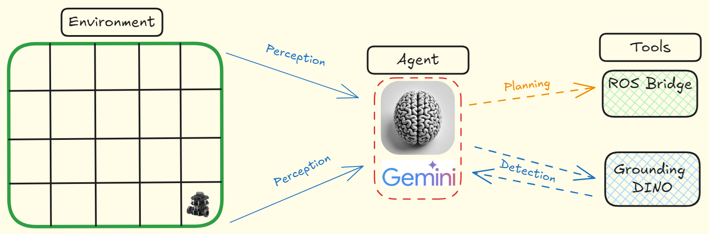

# Improving Vision Capabilities of Gemini with complex tools

This repo contains the code to reproduce the results in the [article](https://github.com/ROBOTIS-GIT/turtlebot3) 

## Folder Structure

- **tools/**: Containes the source code for the Grounding Dino and Location on the grid tools.
- **turtlebot3_llm_camera/**: Contains the ROS package to generate the top-down view of the robot environmetn and the grid.
- **notebook/**: Containes the source code for the experiments with the agent.

